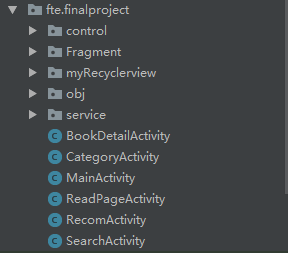
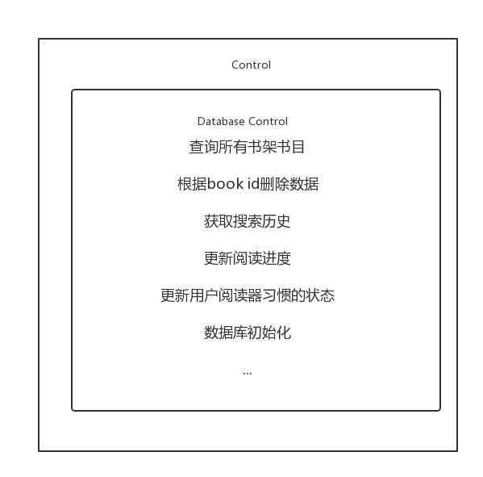
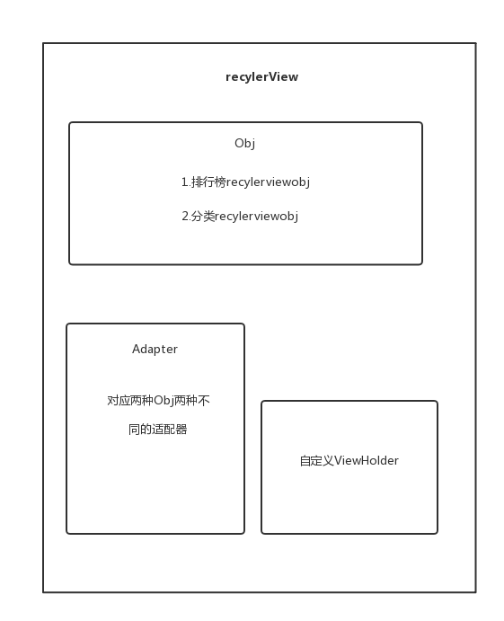
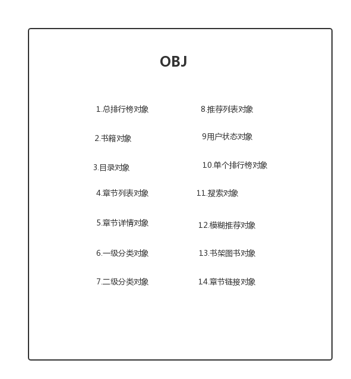
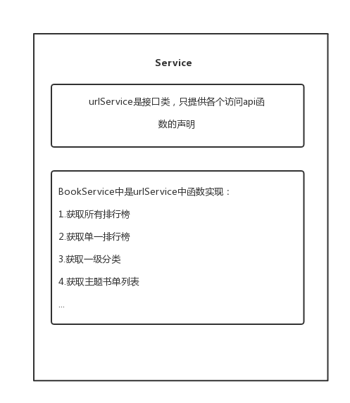
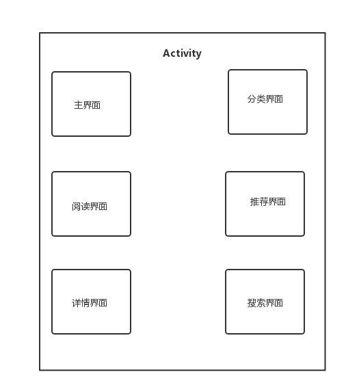

# 中山大学数据科学与计算机学院本科生实验报告

## （2018年秋季学期）

| 13组 | 姓名   | 学号     |
| ---- | ------ | -------- |
| 组长 | 车鑫恺 | 16340014 |
| 组员 | 陈冬禹 | 16340015 |
| 组员 | 陈彬彬 | 16340016 |
| 组员 | 陈帆   | 16340017 |


## 一、应用基本信息

应用名：FTEReader

应用Logo：


## 二、程序运行界面截图

### 主界面

分为书架、排行榜、分类，可从它进入排行榜界面、分类界面、阅读界面。


### 排行榜界面

显示某个排行榜的书籍。


### 分类界面

显示某个分类的书籍。


### 搜索界面

搜索书籍。


### 书籍详情界面

显示书籍的详情。


### 阅读界面

阅读书籍。


### 相关书籍界面

显示与某本书籍相关的一些书籍。


## 三、应用类图/时序图/架构图等

项目结构图：



我们将整个代码分为了6部分：

1. control：包含了创建、操作数据库的函数。

   

2. fragment：

   

3. recylerView：包含和recylerview相关的对象、适配器和基础的viewholder

   

4. object：包含各种api返回对象类、数据库对象类等等

   

5. service：包含api服务相关函数

   

6. activity：该app所有的activity

   


## 四、所采用的技术和采用该技术的原因

### 1.ViewPager+Fragment的使用

**原因**

每一个Fragment对应一个界面，使用此技术来显示界面，能够更流畅地在各个界面之间完成切换，
比如主界面的书架、排行榜、分类就是利用3个Fragment来显示的
再增加RadioGroup作为导航栏，就能够实现类似于微信主界面一样的效果了，各个界面之间切换流畅，具有美感

**方法**

使用的方法就是在布局中添加ViewPager：

```xml
<android.support.v4.view.ViewPager
        android:layout_width="match_parent"
        android:layout_height="0dp"
        android:layout_weight="1"
        android:overScrollMode="never"
        android:scrollbars="none"/>
```

再在Activity中设置Adapter、FragmentList：

```java
private ViewPager viewPager;
private List<Fragment> fragmentList = new ArrayList<>();
private TabFragmentStatePagerAdapter fragmentPagerAdapter;

//初始化Fragment
//...
fragmentList.add(bookShelfFragment);
fragmentList.add(rankingFragment);
fragmentList.add(categoryFragment);
```

设置ViewPager：

```java
viewPager.setOnPageChangeListener(new MyPagerChangeListener());
fragmentPagerAdapter = new TabFragmentStatePagerAdapter(getSupportFragmentManager(), fragmentList);
viewPager.setAdapter(fragmentPagerAdapter);
viewPager.setCurrentItem(0);
viewPager.setOffscreenPageLimit(2);
```

### 2.RadioGroup实现导航栏

**原因**

只有单纯的滑动切换Fragment给用户的提示信息还不够，界面也不够美观，Fragment的分离也不够明显。实现一个导航栏能够让用户明确每一个Fragment的作用。这也是当前许多主流App的做法。

**方法**

利用RadioButton的`android:button="@null"`这个属性来把圆形按钮去掉，再利用`android:drawableTop="@mipmap/bookshelf"`属性来给RadioButton显示不同的图片：

```xml
<RadioButton
            style="@style/BottomRB"
            android:drawableTop="@mipmap/bookshelf"
            />
```

```xml
<style name="BottomRB">
    <item name="android:button">@null</item>
    <item name="android:textColor">@drawable/selector_tab_text_color</item>
</style>
```

在RadioButton被选中时，还需要设置字体的颜色以及改变图片颜色，以达到被选中的效果。这可以在RadioGroup的监听事件中来实现，注意需要设置图片的大小，否则会不适配，设置的方法为：

RadioButton的选中与ViewPager切换帧需要结合起来，才能达到导航栏的效果。

在切换选中的RadioButton时，要修改ViewPager当前显示的帧；在切换ViewPager显示的帧时，要修改被选中的RadioButton。

### 3.网络访问部分使用了名为Retrofit的网络加载框架，其底层使用OKHttp封装，支持rxjava。

**原因**

- 解耦，减少API接口定义和API接口使用的耦合
- 包含许多注解，简化代码，方便使用
- 支持同步、异步、RxJava
- 可以使用不同工具解析数据，如json、xml
- 请求速度快

**方法**

接口类：

```java
@GET("/ranking/gender")
Call<AllRankingObj> getAllRanking();
```

```java
OkHttpClient build = new OkHttpClient.Builder()
        .connectTimeout(2, TimeUnit.SECONDS)
        .readTimeout(2, TimeUnit.SECONDS)
        .writeTimeout(2, TimeUnit.SECONDS)
        .build();

// 用于API访问
Retrofit retrofitForApi = new Retrofit.Builder()
        .baseUrl(ApiUrl)
        // 设置json数据解析器
        .addConverterFactory(GsonConverterFactory.create())
        // RxJava封装OkHttp的Call函数，本质还是利用OkHttp请求数据
        .addCallAdapterFactory(RxJavaCallAdapterFactory.create())
        .client(build)
        .build();
```

### 4.设置同步变量控制线程顺序

**原因**

当输入速度特别快时，有的线程清空了list，而有的线程正在调用list里的元素，这样会发生访问异常，需要设置同步变量使得同一时刻只有一个线程在运行。

**方法**

```java
flag = true; //用于同步问题的布尔变量
if (!s.equals("")&&flag) {
                    new Thread(new Runnable() {
                        @Override
                        public void run() {
                            flag = false;
                            ...
                        }
                    }
                    }
```

### 5.将多个列表放在一个activity下

**原因**

将不同列表放入多个activity里可以使得界面布局简单，但是带来的问题是需要增加许多activity之间的通信，增加了跳转的复杂度，而将列表放入同一个activity里方便跳转时的信息传递。

**方法**

```java
//设置可见
if (!isSubmit) {
    if (s.equals("")) {
        initialLayout.setVisibility(View.VISIBLE);
        searchLayout.setVisibility(View.GONE);
    }
    else {
        initialLayout.setVisibility(View.GONE);
        searchLayout.setVisibility(View.VISIBLE);
        fuzzyList.setVisibility(View.VISIBLE);
        resultList.setVisibility(View.GONE);
    }
}
```

### 6.系统广播获取系统电量和时间

**原因**

用户进入阅读界面时是全屏阅读，顶部状态栏会消失，那么需要有个信息栏来简要显示系统电量和时间

**方法**

1. `onCreate` 中注册广播，接受电量和时钟变化，并创建自定义的广播接收者`MyReceiver`类来处理订阅

```java
//注册广播接受者java代码
intentFilter = new IntentFilter(Intent.ACTION_BATTERY_CHANGED);    // 电量变化广播
intentFilter.addAction(ACTION_TIME_TICK);
//创建广播接受者对象
myReceiver = new MyReceiver();
//注册receiver
registerReceiver(myReceiver, intentFilter);
```

1. 自定义广播接收者类，处理电量和时钟变化广播

```java
class MyReceiver extends BroadcastReceiver {
    @Override
    public void onReceive(Context context, Intent intent) {
        if(Intent.ACTION_BATTERY_CHANGED.equals(intent.getAction())){
            //获取当前电量
            int level = intent.getIntExtra("level", 0);
            //电量的总刻度
            int scale = intent.getIntExtra("scale", 100);
            //把它转成百分比
            int percent = level*100/scale;
            // TODO: Do Something when battery_changed
        }
        else if (Intent.ACTION_TIME_TICK.equals(intent.getAction())) {
            // TODO：Do Something when time_tick
        }
    }
}
```

1. `onDestroy` 中注销广播订阅

```java
unregisterReceiver(myReceiver);
```


------

### 7.非注销生命周期的横竖屏切换

**原因**

1. 小说阅读需要适应用户阅读习惯，有时候用户需要横屏阅读，因此需要实现阅读界面横竖屏模式切换
2. 如果不设置上面第1步的代码，那么横竖屏切换会重新注销Activity，即结束当前活动的生命周期并重新开启一个新的声明周期。这样不仅需要时间重新进行网络访问获取小说章节内容而且会影响到用户使用体验。

**方法**

1. 在`AndroidManifest.xml` 中对Activity 设置属性(关键)

```xml
android:configChanges="orientation|keyboardHidden|screenSize"
android:screenOrientation="portrait"
```

1. 横竖屏切换后台java代码

   切换到横屏

```java
setRequestedOrientation(ActivityInfo.SCREEN_ORIENTATION_LANDSCAPE);
```

​		切换到竖屏

```java
setRequestedOrientation(ActivityInfo.SCREEN_ORIENTATION_PORTRAIT);
```


## 五、成员贡献表和Git提交记录

| 学号     | 名字   | 角色 | 班级   | 职责                                                | 贡献 |
| -------- | ------ | ---- | ------ | --------------------------------------------------- | ---- |
| 16340014 | 车鑫恺 | 组长 | 周四班 | 数据库设计、搜索界面UI及逻辑实现                    | 25%  |
| 16340017 | 陈帆   | 组员 | 周三班 | 主界面、排行榜、分类界面UI及逻辑实现                | 25%  |
| 16340015 | 陈彬彬 | 组员 | 周三班 | 书架、阅读界面UI及逻辑实现                          | 25%  |
| 16340016 | 陈冬禹 | 组员 | 周四班 | 访问API接口设计、书籍详情、更多推荐界面UI及逻辑实现 | 25%  |


## 六、应用部署方法

下载好源码之后通过android studio部署到手机或虚拟机即可，或直接安装report目录下的apk文件。

注：应用开发测试环境的sdk版本最低为22，最高为28。

