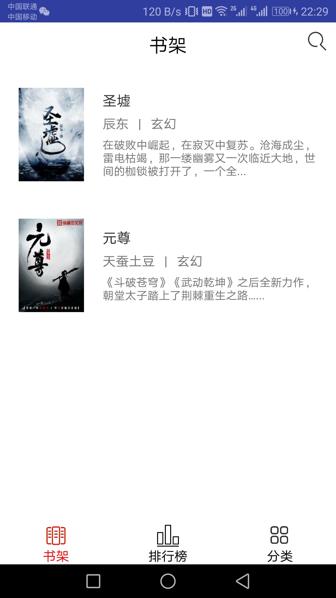
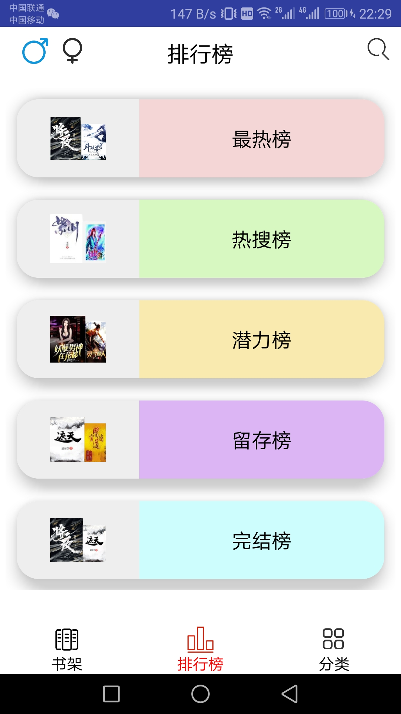
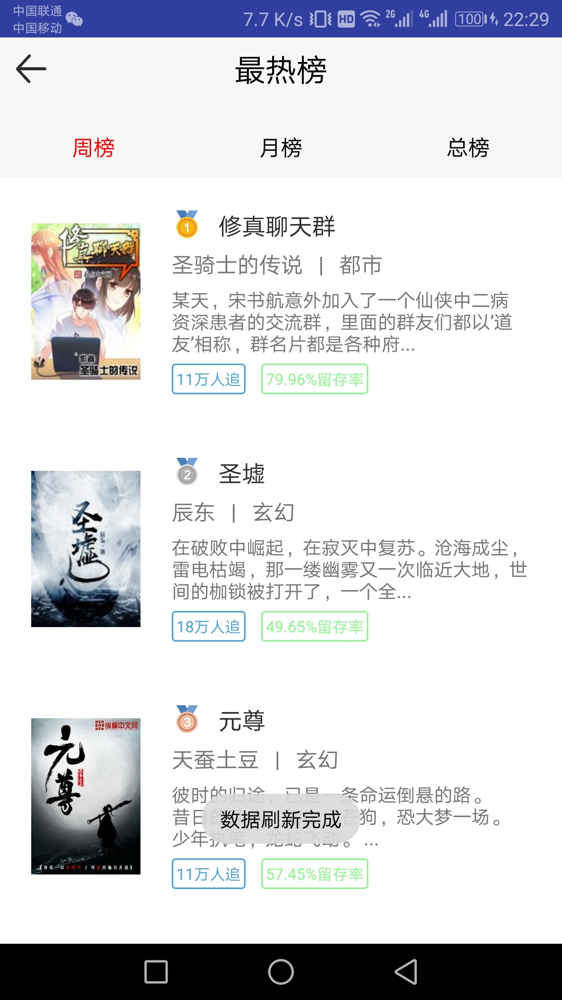
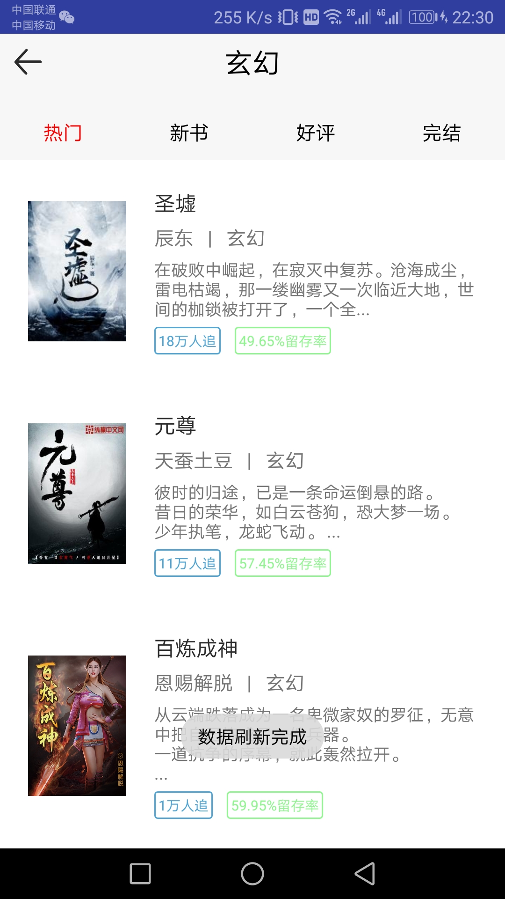
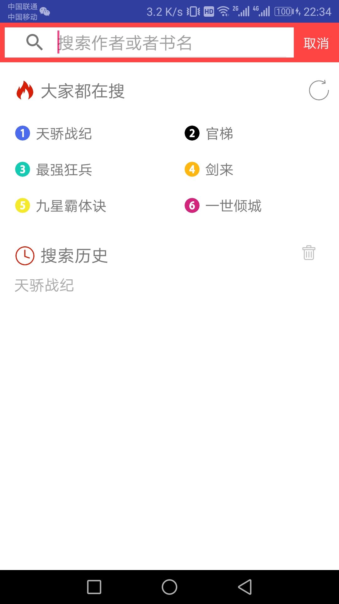
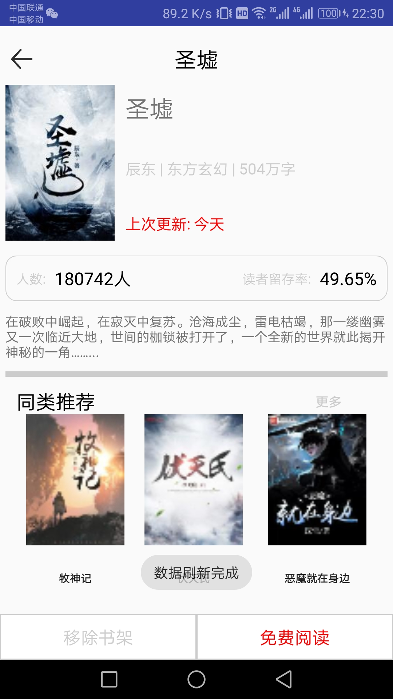
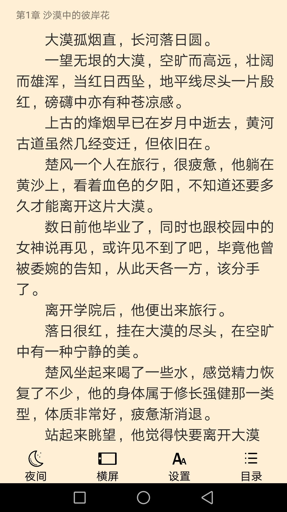
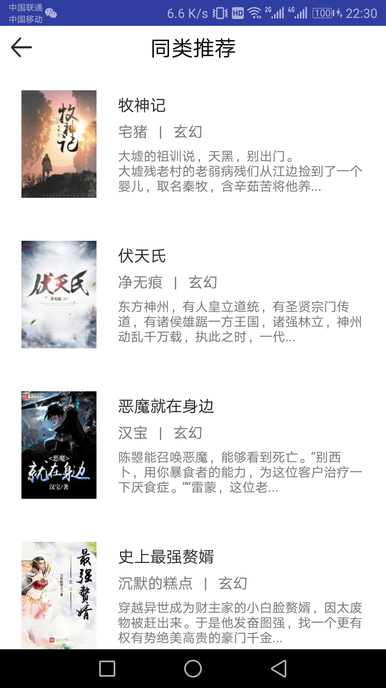

# 用户说明文档

## 界面说明

APP一共有个界面：主界面、排行榜界面、分类界面、书籍详情界面、阅读界面、相关书籍界面

### 主界面

分为书架、排行榜、分类，可从它进入排行榜界面、分类界面、阅读界面。

### 排行榜界面

显示某个排行榜的书籍。

### 分类界面

显示某个分类的书籍。

### 搜索界面

搜索书籍。

### 书籍详情界面

显示书籍的详情。

### 阅读界面

阅读书籍。

### 相关书籍界面

显示与某本书籍相关的一些书籍。

## 功能说明

### 1. 主界面

- 点击下方图标或左右滑动来切换书架、排行榜、分类，点击右上角搜索图标进入搜索界面
- 从书架点击某本书籍进入阅读界面
- 在排行榜处点击左上角♂/♀图标切换男生/女生，点击某个排行榜进入排行榜界面
- 在分类处点击上方按钮切换男生/女生，点击某个分类进入分类界面

### 2. 排行榜界面

- 点击上方按钮切换周榜/月榜/总榜
- 点击某本书籍进入书籍详情界面

### 3. 分类界面

- 点击上方按钮切换热门/新书/好评/完结
- 点击某本书籍进入书籍详情界面

### 4. 搜索界面

- 在上方搜索框中输入书名，点击搜索按钮进行搜索
- 点击搜索结果中的书名跳转到书籍详情界面
- 点击“大家都在搜”/“搜索历史”中的书名直接跳转到书籍详情界面

### 5. 书籍详情界面

- 点击左下角“加入书架”按钮可将当前书籍加入书架
- 点击右下角“免费阅读”按钮跳转到阅读界面
- 点击“同类推荐”中的书籍可跳转到该书籍的详情界面
- 点击“更多”按钮跳转到相关书籍界面

### 6. 阅读界面

- 上下滑动进行阅读，左右滑动切换章节
- 点击屏幕中部，屏幕底部出现菜单：夜间/日间、横屏/竖屏、设置、目录
- 点击“夜间/日间”切换到夜间/日间模式
- 点击“横屏/竖屏”切换到横屏/竖屏模式
- 点击“设置”出现字体大小调整界面，点击“A-”减小字体大小，点击“A+”增大字体大小，点击屏幕其他部分返回
- 点击“目录”出现书籍目录，点击某个章节可跳转到该章节，点击屏幕其他部分返回

### 7. 相关书籍界面

- 点击相关书籍列表中的书籍，跳转到该书籍的详情界面

